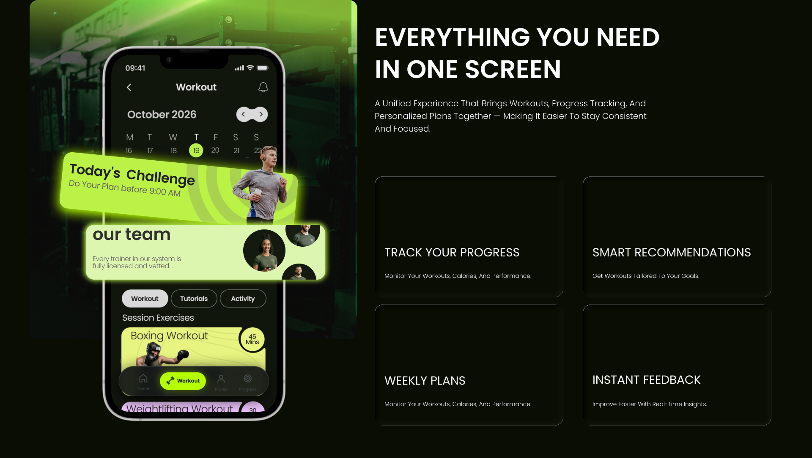
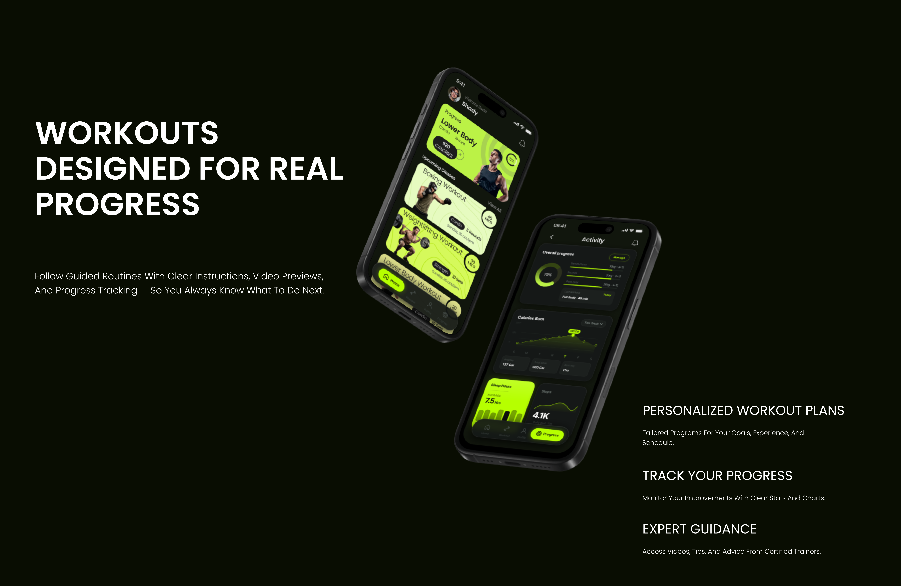

##  Problem
Many fitness apps feel overwhelming or fragmented. Users often struggle to stay consistent because the experience is either too complex, lacks motivation, or doesn’t clearly guide them through their fitness journey. The goal was to design a simpler, more focused gym experience that supports users in building consistent habits without unnecessary friction.

##  Solution
I designed a gym app that prioritizes clarity, structure, and motivation. The experience is built around easy navigation, goal-oriented flows, and a clean interface that helps users track workouts and progress without feeling overwhelmed. Every screen was designed to reduce cognitive load and keep the user focused on their fitness journey.

##  Key Screens

##  Full Case Study
[View on Behance]((https://www.behance.net/gallery/248649851/Gym-Application-Case-study))
